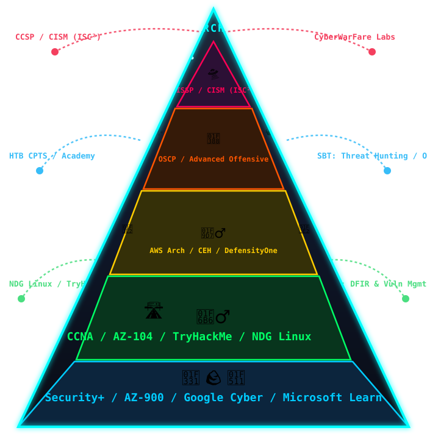

<h1 align="center">
   
</h1> 

<!-- Paneles 3D Flotantes: Subsistemas Activos con Estética Espacial Neón --> 

 
  
  
  

 ⬆️
  🛰️ <em>Paneles de acceso directo a los sitios web y estaciones orbitales desplegadas en vivo.</em>

---

<!-- 1. ZIG: IZQUIERDA -->

<h3 align="center">🛰️ // ORBITAL_CORE_PROFILE</h3>

  Sistemas distribuidos y ciberseguridad avanzada en entornos descentralizados. 
  Fortificación de smart contracts y despliegue de nodos en redes orbitales.

 

  <!-- 1. VS Code -->
  
  <!-- SQL -->
  
  <!-- 2. Podman -->
  
  <!-- 3. VirtualBox -->
  
  <!-- 4. Java -->
  
  <!-- 5. HTML -->
  
  <!-- 6. Llama AI -->
  
  <!-- 7. Copilot -->
  
  <!-- 8. ChatGPT -->
  
  <!-- Gemini -->
  
  <!-- 10. JavaScript -->
  
  <!-- 11. TypeScript -->
  
  <!-- 12. Python -->
  
  <!-- 13. Git -->
  
  <!-- 14. Linux -->
  
  <!-- 15. Docker -->
  

---

## 📡 // ORBITAL_TELEMETRY & ASSETS (NUEVOS MÓDULOS)

<!-- 2. ZAG: DERECHA -->

  

 

---

<!-- 3. ZIG: IZQUIERDA -->

  

 

  
  

---

<!-- Iconos de Herramientas de Ciberseguridad con Efecto 3D Neón e Iluminación -->

  <!-- NMAP -->
  
  <!-- WIRESHARK -->
  
  <!-- BURP SUITE -->
  
  <!-- METASPLOIT -->
  
  <!-- KALI LINUX -->
  
  <!-- NESSUS -->
  
  <!-- BASH -->
  
  <!-- ELASTIC SECURITY -->
  

<!-- Texto explicativo centrado -->

  🛠️ <em>Herramientas clave del arsenal ofensivo y defensivo desplegadas en el entorno.</em>

---

<!-- Consola Animada de Movimiento Cósmico en Tiempo Real -->

  

## 🕶️ // COMMAND_CONSOLE_STREAM (HUD ESPACIAL EN VIVO) ✝️🤍

<!-- 4. ZAG: DERECHA -->

  

 

<!-- 5. ZIG: IZQUIERDA -->

  

 

  

---

<!-- 6. ZAG: DERECHA -->

  

 

---

<!-- 7. ZIG (Izquierda) y 8. ZAG (Derecha) Finales -->

  
  

 
